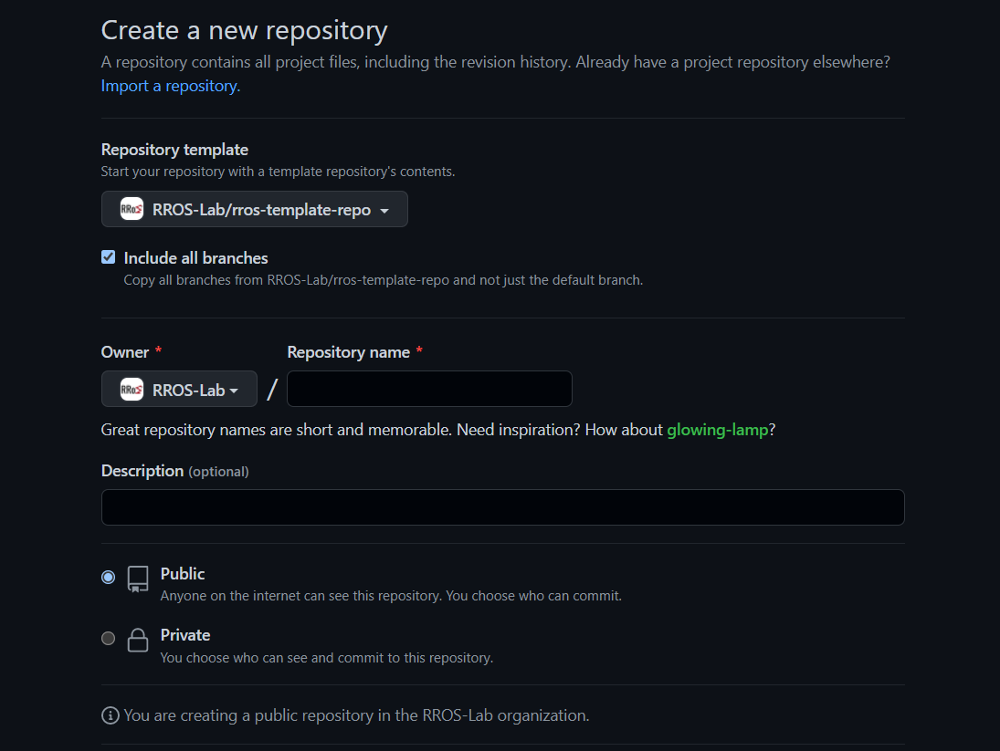

## Contributor Guide

Welcome to RROS ~
  
### Create a Repository on GitHub
1. It is highly recommended to use the template repository [rros-template-repo](https://github.com/RROS-Lab/rros-template-repo) when you create a new repository.

1. Add the "admin" team to your new repository.

1. If the new repository is public, please contact any member in the admin team so we can update the repository list.

### Bind Local Repository with Remote Repository
Now you have already create a remote repository on the GitHub, the next step is to bind it with your local repository. There are three kinds of situation.

1. You do not have a local repository  
    This means you have not run `git init` in your target directory / folder.

    Now all you need to do is run
    
    `git clone [your remote repository link]` 

    Then you can start coding in your local repository.

1. You have init a local repository without any remote repository bound with it  
    Run:  
    `git remote add origin [your remote repository link]` 

1. You have init a local repository，but there is already a remote repository bound with it  
    Save your work first  
    Then run:  
    `git remote set-url origin [your NEW remote repository link]`
