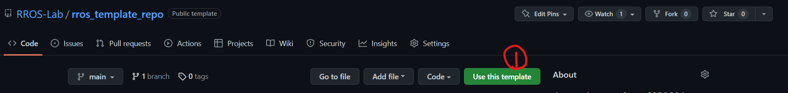
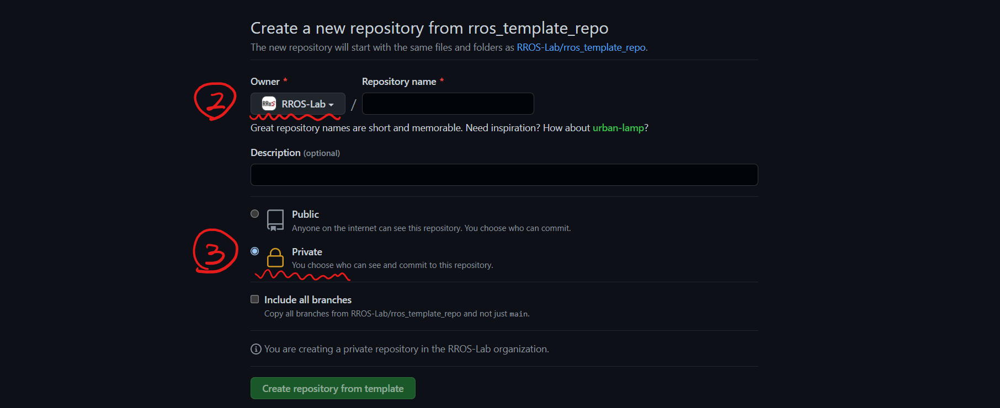
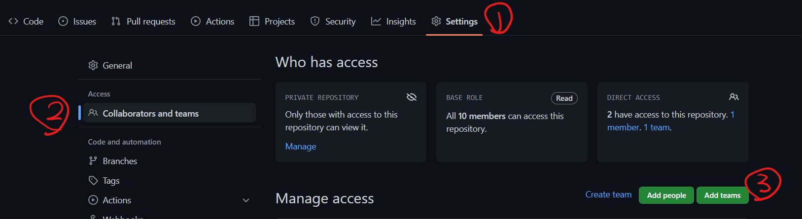

## Contributor Guide

[RROS Home](https://github.com/RROS-Lab)

Hi! Welcome to RROS ~

### Content
- [Create a Repository on GitHub](#create-a-repository-on-github)
- [Bind Local with Remote](#bind-local-repository-with-remote-repository)
- [Manage Branches and Pull Request](#manage-branches-and-pull-request)
- [Make a Repository Public](#make-a-repository-public)

### Create a Repository on GitHub
1. It is highly recommended to use the template repository [rros_template_repo](https://github.com/RROS-Lab/rros_template_repo) when you create a new repository (should be **private** when developing).

  
  

2. Add the "admin" team to your new repository.

  

### Bind Local Repository with Remote Repository
Now you have already create a remote repository on the GitHub, the next step is to bind it with your local repository. There are three kinds of situation.

1. You do not have a local repository  
    This means you have not run `git init` in your target directory / folder.

    Now all you need to do is run
    
    `git clone [your remote repository link]` 

    Then you can start coding in your local repository.

1. You have init a local repository without any remote repository bound with it  
    Run:  
    `git remote add origin [your remote repository link]` 

1. You have init a local repository，but there is already a remote repository bound with it  
    Save your work first  
    Then run:  
    `git remote set-url origin [your NEW remote repository link]`

### Manage Branches and Pull Request

1. For any new feature, we highly recommended you start a new branch and work on it (to make the main branch clean).   

    For example, if you want to develop a feature "dance" on a robot. After talking with the project manager, you can add a new branch in the local repo, e.g.,"feature/dance" by using  
    `git checkout -b feature/dance`  
    Then you can work on it ( `git pull` / `git rebase` /`git add` / `git commit`)

1. If you finished your work and the code has passed all the tests, push your branch to GitHub and [make a pull request](https://docs.github.com/en/pull-requests/collaborating-with-pull-requests/proposing-changes-to-your-work-with-pull-requests/creating-a-pull-request). After the pull request is approved, merge your branch to the main branch **online**, if necessary, [address the conflicts](https://docs.github.com/en/pull-requests/collaborating-with-pull-requests/addressing-merge-conflicts/resolving-a-merge-conflict-on-github).  
    
1. After updating the main branch, you can delete the feature branch on the GitHub and in your local repository

### Make a Repository Public

1. Please contact any member in the [admin team](https://github.com/orgs/RROS-Lab/teams/admin) so we can update the repository list.

1. Delete the ".gitignore" file

1. Write the README

1. Add a ".rosinstall" file if necesary

